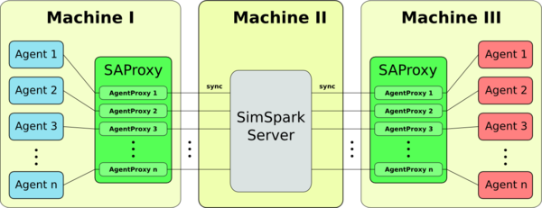

# magmaProxy

Proxy for the [RoboCup 3D Soccer Simulation League](http://wiki.robocup.org/wiki/Soccer_Simulation_League) created by the [magmaOffenburg team](http://robocup.hs-offenburg.de/).

The Simspark Agent Proxy is a proxy for client agents, connecting to the
Simspark server. Its main purpose is to ensure independence of network
issues/delays, by monitoring think cycle times of agents on the client machine.
The proxy is developed using Java 1.6.
It should be compatible with older JREs, too, but this is not verified.

## Contents

- [Installation](#installation)
- [Preparation](#preparation)
- [Usage](#usage)
- [Command Line Interface](#command-line-interface)
- [Concepts](#concepts)
- [Implementation](#implementation)
- [Command Line Parameter](#command-line-parameter)

## Installation

- Clone the repository: `git clone https://github.com/magmaOffenburg/magmaProxy`.
- Make sure you have Java installed and available on your command line.
- Make sure you have [simspark and rcsserver3d](http://simspark.sourceforge.net/wiki/index.php/Main_Page) installed and the command `rcssserver3d` is available on your command line.
- The proxy itself does not require an installation.

## Preparation
Before you can use the proxy, you have to configure the soccer server to run in sync mode.
Change attribute `agentSyncMode` in the config file of the server `~/.simspark/spark.rb` to true.

## Usage
The process of running a soccer game with the proxy is as follows:

1. Start the server on the server computer with `rcssserver3d`.
2. Start a proxy instance on each client computer (see below).
3. Start the agents making sure they get the proxy port passed to the `start.sh` script

To simplify starting of the proxy, a start script is provided:

`./startProxy.sh <simspark-server-IP> <simspark-server-Port> <proxy-server-port>`

- `<simspark-server-IP>`: IP address of the soccer server.
- `<simspark-server-Port>`: Port of the soccer server.
- `<proxy-server-port>`: Port on the proxy's machine to which the players have to connect.

## Command Line Interface

The following commands are provided when the proxy is running:

- "q", or "quit" : Shutdown the proxy server and exit the program
- "l", or "list" : List active agent proxy instances
- "s", or "status" : Print proxy live status and list of all agent proxy instances 
- "v", or "verbose" : Verbosly list active agent proxies
- "m" : Switch on/off printing start of all client messages
- "n" : Switch on/off printing start of all server messages

## Concepts
To simplify agent and server programming, the presence of an agent proxy should be transparent and not require any additional code on any side.
In this concept, a proxy server instance wraps connections to one specific SimSpark server. 
Each incoming connection is assigned to a new agent proxy instance, which handles all proxy communication for the assigned connection. 
The agent proxy instance itself consists of two threads, one for forwarding server perception messages and maintaining sync-times and one 
for forwarding agent action messages. In this concept, maintaining the response time of agents is done by simply waiting 20ms after 
forwarding a perception message to the agent, before sending a "sync"-command back to the server in one thread, while the other thread 
keeps directly forwarding action messages from the agent. In order to stay synchronized with the SimSpark server, 
the perception messages forwarding thread always has to first forward all pending perception messages from the server, 
before waiting and responding with the next "sync"-command. 

This concept is simple, transparent for client and server and dynamic with respect to the amount of connections. 
It restores synchronization (needed during the startup) and treats each connected agent equally. 
The time measurement is as accurate as the sleep command of the underlying platform. 
If the sleep command is not considered precise enough, this concept can be easily extended to suppress the forwarding of action
messages after the specified time, until the next "sync"-command has been send. 

## Implementation
The SimSpark Agent Proxy is implemented in Java and separated across four classes: 
SAProxy, SimsparkAgentProxyServer, AgentProxy and Connection. 

- The SAProxy class contains the main function and provides a command line interface to monitor the proxy server. 
It currently only maintains one proxy server instance. 

- The SimsparkAgentProxyServer is the actual proxy server thread. 
It listens to a specified port and creates an AgentProxy instance for each incoming connection request. 

- The AgentProxy then establishes a connection to the SimSpark server and starts two threads: 
ServerPerceptionsForwarder and ClientActionsForwarder. 
The first thread simply forwards all pending perception messages to the local client 
agent, sleeps for 20ms and then sends a "sync"-command to the SimSpark server. 
Similarly, the second thread directly forwards incoming action messages from the client agent, 
after removing all "sync"-commands from the respective action messages. 

- The Connection class handles message sending and receiving through sockets

## Command Line Parameter

The SimSpark Agent Proxy has following command line parameters:

- `--proxyPort=<port>` : The proxy server port for incoming connections
- `--ssHost=<ip>` : The SimSpark server host
- `--ssPort=<port>` : The SimSpark server port 
- `--verbose` : Prints the messages of all agents
